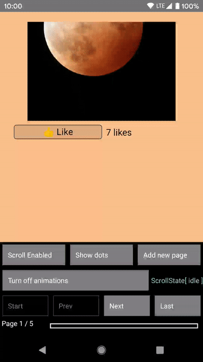

# react-native-pager-view 

[](https://badge.fury.io/js/react-native-pager-view)
[](https://github.com/facebook/react-native/issues/23313)
[](https://github.com/callstack/react-native-pager-view/blob/master/LICENSE)

[](https://github.com/callstack/react-native-pager-view/actions/workflows/main.yml)
[](https://github.com/callstack/react-native-pager-view/actions/workflows/ios.yml)
[](https://github.com/callstack/react-native-pager-view/actions/workflows/android.yml)

This component allows the user to swipe left and right through pages of data. Under the hood it is using the native [Android ViewPager](https://developer.android.com/reference/android/support/v4/view/ViewPager) and the [iOS UIPageViewController](https://developer.apple.com/documentation/uikit/uipageviewcontroller) implementations. [See it in action!](https://github.com/callstack/react-native-pager-view#preview)

<br/>
<p align="center">
  
</p>

<br/>

## Versions

| 4.x        | 5.x         |
| ---------- | ----------- |
| iOS        | iOS support |
| ViewPager1 | ViewPager2  |

## New architecture support (Fabric)

This library supports both architectures (Paper and Fabric). If you would like enable new architecture, please run below command:

`yarn add react-native-pager-view@newarch`


## Migration

In version **6.x** support for `transitionStyle` property has been dropped. More information [here](https://github.com/callstack/react-native-pager-view/blob/master/MIGRATION.md).

`"@react-native-community/viewpager"` library has been changed to `react-native-pager-view`. Here you can find more information, how to migrate pager view to the latest [version](https://github.com/callstack/react-native-pager-view/blob/master/MIGRATION.md)

## Getting started

`yarn add react-native-pager-view`

## New architecture setup (Fabric)

This library supports new architecture! We have two example folders one for each architecture. If you are using this library in your own project there some extra steps needed. 
### iOS
Install pods with this flag inside `ios` folder: 
```sh
RCT_NEW_ARCH_ENABLED=1 bundle exec pod install
``` 
(Inside of `fabricexample` the `RCT_NEW_ARCH_ENABLED` is already set to true by default inside `Podfile`)

### Android
Set `newArchEnabled` to `true` inside `android/gradle.properties` (this flag is already set to true in `fabricexample`) and then run: 
```sh
yarn android
```

If you have issues with running android build you can try to generate codegen before the build using this command: 

```sh
cd android && ./gradlew generateCodegenArtifactsFromSchema
```


## Linking

### >= 0.60

Autolinking will just do the job.

### < 0.60

#### Mostly automatic

`react-native link react-native-pager-view`

#### Manual linking

<details>
<summary>Manually link the library on iOS</summary>
</br>

Follow the [instructions in the React Native documentation](https://facebook.github.io/react-native/img/linking-libraries-ios#manual-linking) to manually link the framework or link using [Cocoapods](https://cocoapods.org) by adding this to your `Podfile`:

```ruby
pod 'react-native-pager-view', :path => '../node_modules/react-native-pager-view'
```

</details>

<details>
<summary>Manually link the library on Android</summary>
</br>
Make the following changes:

#### `android/settings.gradle`

```groovy
include ':react-native-pager-view'
project(':react-native-pager-view').projectDir = new File(rootProject.projectDir, '../node_modules/react-native-pager-view/android')
```

#### `android/app/build.gradle`

```groovy
dependencies {
   ...
   implementation project(':react-native-pager-view')
}
```

#### `android/app/src/main/.../MainApplication.java`

On top, where imports are:

Add `import com.reactnativepagerview.PagerViewPackage;`

Add the `PagerViewPackage` class to your list of exported packages.

```java
@Override
protected List<ReactPackage> getPackages() {
  return Arrays.<ReactPackage>asList(
    new MainReactPackage(),
    new PagerViewPackage()
  );
}
```

</details>

## Usage

```js
import React from 'react';
import { StyleSheet, View, Text } from 'react-native';
import PagerView from 'react-native-pager-view';

const MyPager = () => {
  return (
    <PagerView style={styles.pagerView} initialPage={0}>
      <View key="1">
        <Text>First page</Text>
      </View>
      <View key="2">
        <Text>Second page</Text>
      </View>
    </PagerView>
  );
};

const styles = StyleSheet.create({
  pagerView: {
    flex: 1,
  },
});
```

**Attention:** Note that you can only use `View` components as children of `PagerView` (cf. folder _/example_)
. For Android if `View` has own children, set prop `collapsable` to false <https://reactnative.dev/docs/view#collapsable-android>, otherwise react-native might remove those children views and and its children will be rendered as separate pages

## Advanced usage

For advanced usage please take a look into our [example project](https://github.com/callstack/react-native-pager-view/blob/master/example/src/BasicPagerViewExample.tsx)

## API

| Prop                                                                 |                                                                                                                             Description                                                                                                                             | Platform |
| -------------------------------------------------------------------- | :-----------------------------------------------------------------------------------------------------------------------------------------------------------------------------------------------------------------------------------------------------------------: | :------: |
| `initialPage`                                                        |                                                                                                            Index of initial page that should be selected                                                                                                            |   both   |
| `scrollEnabled: boolean`                                             |                                                                                                            Should pager view scroll, when scroll enabled                                                                                                            |   both   |
| `onPageScroll: (e: PageScrollEvent) => void`                         |                                                    Executed when transitioning between pages (ether because the animation for the requested page has changed or when the user is swiping/dragging between pages)                                                    |   both   |
| `onPageScrollStateChanged: (e: PageScrollStateChangedEvent) => void` |                                                                                                      Function called when the page scrolling state has changed                                                                                                      |   both   |
| `onPageSelected: (e: PageSelectedEvent) => void`                     |                                                                                      This callback will be called once the ViewPager finishes navigating to the selected page                                                                                       |   both   |
| `pageMargin: number`                                                 |                                                                                                                Blank space to be shown between pages                                                                                                                |   both   |
| `keyboardDismissMode: ('none' / 'on-drag')`                          |                                                                                                Determines whether the keyboard gets dismissed in response to a drag                                                                                                 |   both   |
| `orientation: Orientation`                                           |                                                                                       Set `horizontal` or `vertical` scrolling orientation (it does **not** work dynamically)                                                                                       |   both   |
| `overScrollMode: OverScollMode`                                      |                                                                              Used to override default value of overScroll mode. Can be `auto`, `always` or `never`. Defaults to `auto`                                                                              | Android  |
| `offscreenPageLimit: number`                                         | Set the number of pages that should be retained to either side of the currently visible page(s). Pages beyond this limit will be recreated from the adapter when needed. Defaults to RecyclerView's caching strategy. The given value must either be larger than 0. | Android  |
| `overdrag: boolean`                                                  |                                                                                       Allows for overscrolling after reaching the end or very beginning or pages. Defaults to `false`                                                                               |   iOS    |
| `layoutDirection: ('ltr' / 'rtl' / 'locale')`                        |                                                                                       Specifies layout direction. Use `ltr` or `rtl` to set explicitly or `locale` to deduce from the default language script of a locale. Defaults to `locale`                     |   both    |

| Method                                     |                                                                                                         Description                                                                                                          | Platform |
| ------------------------------------------ | :--------------------------------------------------------------------------------------------------------------------------------------------------------------------------------------------------------------------------: | :------: |
| `setPage(index: number)`                   |                                                                      Function to scroll to a specific page in the PagerView. Invalid index is ignored.                                                                       |   both   |
| `setPageWithoutAnimation(index: number)`   |                                                                      Function to scroll to a specific page in the PagerView. Invalid index is ignored.                                                                       |   both   |
| `setScrollEnabled(scrollEnabled: boolean)` | A helper function to enable/disable scroll imperatively. The recommended way is using the scrollEnabled prop, however, there might be a case where a imperative solution is more useful (e.g. for not blocking an animation) |   both   |

## Contributing

See the [contributing guide](CONTRIBUTING.md) to learn how to contribute to the repository and the development workflow.

## Known Issues

- `flex:1` does not work for child views, please use `width: '100%', height: '100%'` [instead](https://github.com/callstack/react-native-pager-view/issues/186#issuecomment-675320732)

- [iOS]: In case of `UIViewControllerHierarchyInconsistency` error, please use below fix:

```
requestAnimationFrame(() => refPagerView.current?.setPage(index));
```

## Preview

### Android

|                            horizontal                             |                                  vertical                                  |
| :---------------------------------------------------------------: | :------------------------------------------------------------------------: |
|  |  |

### iOS

|                            horizontal                                |                              vertical                                  |
| :------------------------------------------------------------------: | :--------------------------------------------------------------------: |
|  |  |

## Reanimated onPageScroll handler

An example can be found [here](https://github.com/callstack/react-native-pager-view/blob/master/example/src/ReanimatedOnPageScrollExample.tsx)

#### Instructions

To attach reanimated handler with `onPageScroll` follow the below steps.

```jsx
// 1. Define the handler
function usePageScrollHandler(handlers, dependencies) {
  const {context, doDependenciesDiffer} = useHandler(handlers, dependencies);
  const subscribeForEvents = ['onPageScroll'];

  return useEvent(
    event => {
      'worklet';
      const {onPageScroll} = handlers;
      if (onPageScroll && event.eventName.endsWith('onPageScroll')) {
        onPageScroll(event, context);
      }
    },
    subscribeForEvents,
    doDependenciesDiffer,
  );
}
  
// 2. Attach the event handler
import PagerView from "react-native-pager-view";
import Animated from "react-native-reanimated";
const AnimatedPagerView = Animated.createAnimatedComponent(PagerView);

const pageScrollHandler = usePageScrollHandler({
    onPageScroll: e => {
      'worklet';
      offset.value = e.offset;
      console.log(e.offset, e.position);
    },
});

<AnimatedPagerView onPageScroll={pageScrollHandler}/>
```
## License

MIT
