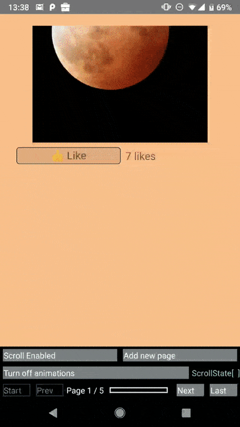
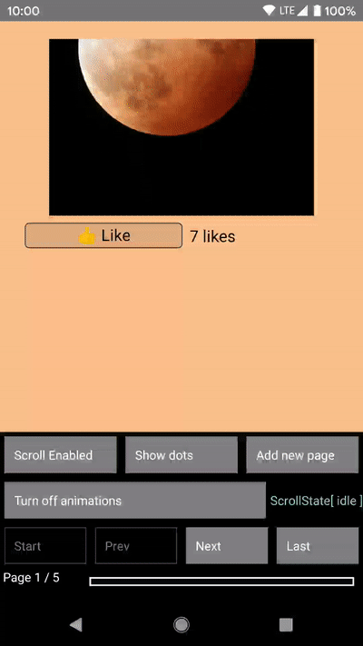
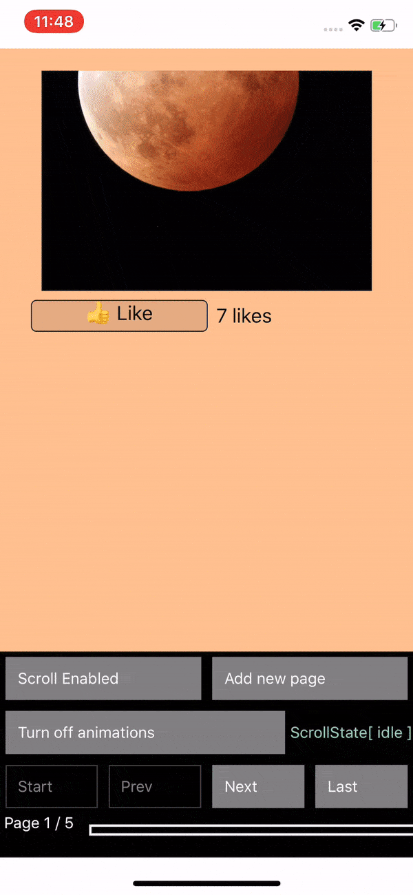

# react-native-viewpager 

[](https://circleci.com/gh/callstack/react-native-viewpager/tree/master)
[](https://badge.fury.io/js/%40react-native-community%2Fviewpager)
[](https://github.com/facebook/react-native/issues/23313)
[](https://github.com/callstack/react-native-viewpager/blob/master/LICENSE)

This component allows the user to swipe left and right through pages of data. Under the hood it is using the native [Android ViewPager](https://developer.android.com/reference/android/support/v4/view/ViewPager) and the [iOS UIPageViewController](https://developer.apple.com/documentation/uikit/uipageviewcontroller) implementations. [See it in action!](https://github.com/react-native-community/react-native-viewpager#preview)

<br/>
<p align="center">
  
</p>

<br/>

## Versions

| 3.x                | ~~4.0.x, 4.1.x~~  | >= 4.2.x                                                                                            | 5.x
| -------------      | -------------     | -------------                                                                                       | -------------       |
| iOS support        | Deprecated        | iOS support                                                                                         | iOS support         |
| ViewPager1 support | Deprecated        | [Reverted to 3.3.0](https://github.com/callstack/react-native-viewpager/issues/233#issue-711000654) | ViewPager2 support  |

## Getting started

`yarn add @react-native-community/viewpager`

## Linking

### >= 0.60

Autolinking will just do the job.

### < 0.60

#### Mostly automatic

`react-native link @react-native-community/viewpager`

#### Manual linking

<details>
<summary>Manually link the library on iOS</summary>
</br>

Follow the [instructions in the React Native documentation](https://facebook.github.io/react-native/docs/linking-libraries-ios#manual-linking) to manually link the framework or link using [Cocoapods](https://cocoapods.org) by adding this to your `Podfile`:

```ruby
pod 'react-native-viewpager', :path => '../node_modules/@react-native-community/viewpager'
```

</details>

<details>
<summary>Manually link the library on Android</summary>
</br>
Make the following changes:

#### `android/settings.gradle`

```groovy
include ':@react-native-community_viewpager'
project(':@react-native-community_viewpager').projectDir = new File(rootProject.projectDir, '../node_modules/@react-native-community/viewpager/android')
```

#### `android/app/build.gradle`

```groovy
dependencies {
   ...
   implementation project(':@react-native-community_viewpager')
}
```

#### `android/app/src/main/.../MainApplication.java`

On top, where imports are:

```java
import com.reactnativecommunity.viewpager.RNCViewPagerPackage;
```

Add the `RNCViewPagerPackage` class to your list of exported packages.

```java
@Override
protected List<ReactPackage> getPackages() {
  return Arrays.<ReactPackage>asList(
    new MainReactPackage(),
    new RNCViewPagerPackage()
  );
}
```

</details>

## Usage

```js
import React from 'react';
import {StyleSheet, View, Text} from 'react-native';
import ViewPager from '@react-native-community/viewpager';

const MyPager = () => {
  return (
    <ViewPager style={styles.viewPager} initialPage={0}>
      <View key="1">
        <Text>First page</Text>
      </View>
      <View key="2">
        <Text>Second page</Text>
      </View>
    </ViewPager>
  );
};

const styles = StyleSheet.create({
  viewPager: {
    flex: 1,
  },
});
```

**Attention:** Note that you can only use `View` components as children of `ViewPager` (cf. folder */example*)
. For Android if `View` has own children, set prop `collapsable` to false <https://reactnative.dev/docs/view#collapsable>, otherwise react-native might remove those children views and  and it's children will be rendered as separate pages

## Advanced usage

For advanced usage please take a look into our [example project](https://github.com/callstack/react-native-viewpager/blob/master/example/src/BasicViewPagerExample.tsx)

## API

|Prop|Description|Platform|
|-|:-----:|:---:|
|`initialPage`|Index of initial page that should be selected|both
|`scrollEnabled: boolean`|Should viewpager scroll, when scroll enabled|both
|`onPageScroll: (e: PageScrollEvent) => void`|Executed when transitioning between pages (ether because the animation for the requested page has changed or when the user is swiping/dragging between pages)|both
|`onPageScrollStateChanged: (e: PageScrollStateChangedEvent) => void`|Function called when the page scrolling state has changed|both
|`onPageSelected: (e: PageSelectedEvent) => void`|This callback will be called once the ViewPager finishes navigating to the selected page|both
|`pageMargin: number`|Blank space to be shown between pages|both
|`keyboardDismissMode: ('none' / 'on-drag')`| Determines whether the keyboard gets dismissed in response to a drag|both
|`orientation: Orientation`|Set `horizontal` or `vertical` scrolling orientation (it does **not** work dynamically)|both
|`transitionStyle: TransitionStyle`|Use `scroll` or `curl` to change transition style (it does **not** work dynamically)|iOS
|`showPageIndicator: boolean`|Shows the dots indicator at the bottom of the view|iOS
|`overScrollMode: OverScollMode`|Used to override default value of overScroll mode. Can be `auto`, `always` or `never`. Defaults to `auto`|Android
|`offscreenPageLimit: number`|Set the number of pages that should be retained to either side of the currently visible page(s). Pages beyond this limit will be recreated from the adapter when needed. Defaults to RecyclerView's caching strategy. The given value must either be larger than 0.|Android
|`overdrag: boolean`|Allows for overscrolling after reaching the end or very beginning or pages|iOS

## Development workflow

To get started with the project, run `yarn bootstrap` in the root directory to install the required dependencies.

```sh
yarn bootstrap
```

While developing, you can run the example to check your changes

```sh
cd example
yarn android
yarn ios
```

Before sending a pull rquest, make sure your code passes TypeScript and ESLint. Run the following to verify:

```sh
yarn typescript
yarn lint
```

To fix formatting errors, run the following:

```sh
yarn lint --fix
```

## Preview

### Android

horizontal                 |  vertical
:-------------------------:|:-------------------------:
 |  

### iOS

horizontal - scroll      |  horizontal - curl
:-------------------------:|:-------------------------:
  |  

vertical - scroll        |  vertical - curl
:-------------------------:|:-------------------------:
  |  
