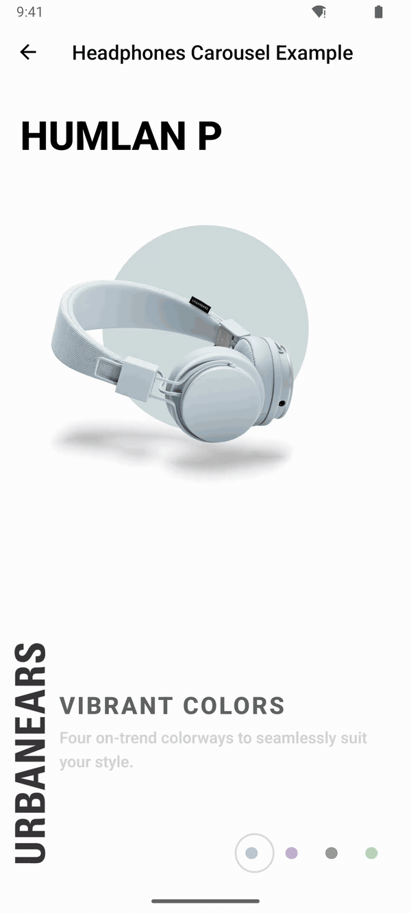
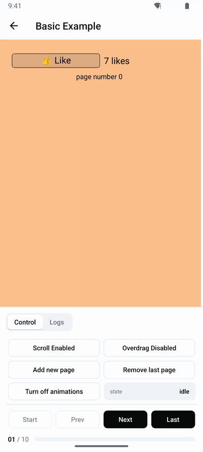
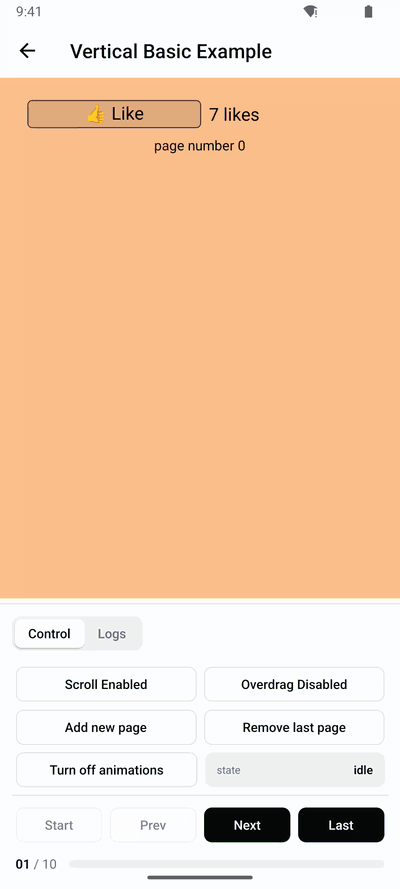
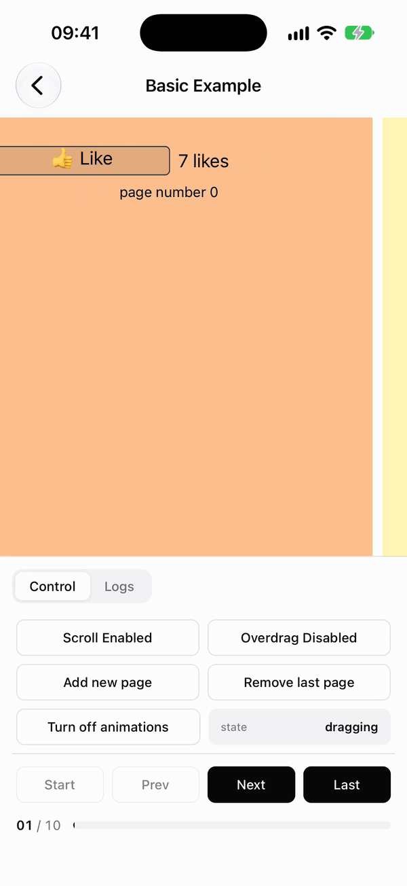
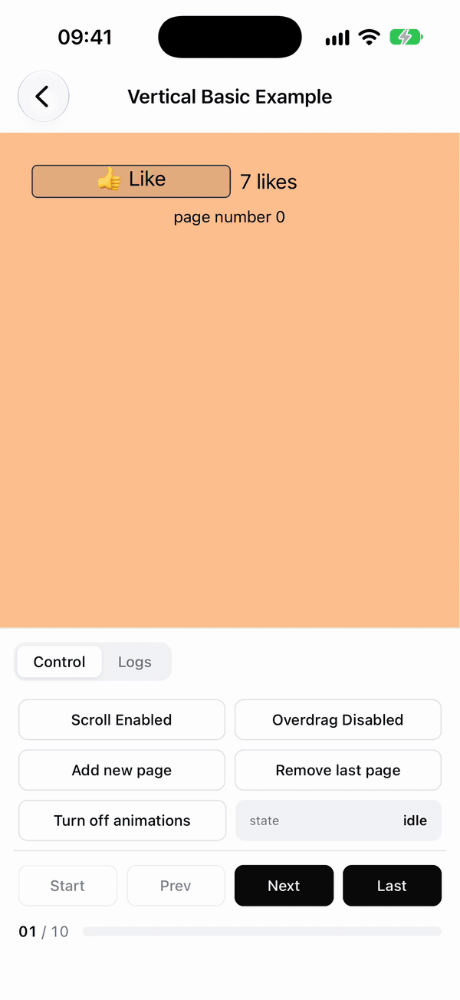

<a href="https://www.callstack.com/open-source?utm_campaign=generic&utm_source=github&utm_medium=referral&utm_content=react-native-pager-view" align="center">
   <picture>
     
   </picture>
</a>

# react-native-pager-view

[](https://badge.fury.io/js/react-native-pager-view)
[](https://github.com/facebook/react-native/issues/23313)
[](https://github.com/callstack/react-native-pager-view/blob/master/LICENSE)

[](https://github.com/callstack/react-native-pager-view/actions/workflows/main.yml)
[](https://github.com/callstack/react-native-pager-view/actions/workflows/ios.yml)
[](https://github.com/callstack/react-native-pager-view/actions/workflows/android.yml)

`PagerView` lets users swipe left and right (or up and down) through pages of content. It is a native component: on Android it renders a [Jetpack Compose pager](https://developer.android.com/develop/ui/compose/layouts/pager), and on iOS a [SwiftUI paged `TabView`](https://developer.apple.com/documentation/swiftui/tabview). [See it in action!](#preview)

<br/>
<p align="center">
  
</p>

<br/>

## Installation

```sh
npm install react-native-pager-view
# or
yarn add react-native-pager-view
# or
bun add react-native-pager-view
```

The library is autolinked. On iOS, install the pods afterwards:

```sh
cd ios && pod install
```

## Usage

```tsx
import { StyleSheet, View, Text } from 'react-native';
import PagerView from 'react-native-pager-view';

export function MyPager() {
  return (
    <PagerView style={styles.pagerView} initialPage={0}>
      <View key="1">
        <Text>First page</Text>
      </View>
      <View key="2">
        <Text>Second page</Text>
      </View>
    </PagerView>
  );
}

const styles = StyleSheet.create({
  pagerView: {
    flex: 1,
  },
});
```

Each direct child of `PagerView` becomes one page and is stretched to fill the pager. Give every child a unique `key`.

To control the pager from code, keep a ref and call its [methods](#methods):

```tsx
const ref = useRef<PagerView>(null);

// ...
<PagerView ref={ref} style={{ flex: 1 }}>
  {pages}
</PagerView>;

// later
ref.current?.setPage(2);
```

For more examples, see the [example app](example/src): nested pagers, keyboard handling, tab views, pagination dots, carousels and more.

## API

### Props

| Prop                                                                       | Description                                                                                                                             | Platform |
| -------------------------------------------------------------------------- | --------------------------------------------------------------------------------------------------------------------------------------- | :------: |
| `initialPage: number`                                                      | Index of the page that is selected on mount.                                                                                            |   both   |
| `scrollEnabled: boolean`                                                   | Whether the user can swipe between pages. Defaults to `true`.                                                                           |   both   |
| `orientation: 'horizontal' \| 'vertical'`                                  | Scroll direction. Defaults to `horizontal`. Changing it after mount is not supported.                                                   |   both   |
| `layoutDirection: 'ltr' \| 'rtl' \| 'locale'`                              | Layout direction. Use `ltr` or `rtl` to set it explicitly, or `locale` to follow `I18nManager.isRTL`. Defaults to `locale`.             |   both   |
| `pageMargin: number`                                                       | Blank space between pages.                                                                                                              |   both   |
| `keyboardDismissMode: 'none' \| 'on-drag'`                                 | Whether the keyboard is dismissed when the user drags the pager. Defaults to `none`.                                                    |   both   |
| `onPageScroll: (e: PagerViewOnPageScrollEvent) => void`                    | Called while moving between pages, either from a swipe or from an animated `setPage`. `e.nativeEvent` contains `position` and `offset`. |   both   |
| `onPageSelected: (e: PagerViewOnPageSelectedEvent) => void`                | Called once the pager settles on a page, and once on mount for `initialPage`. `e.nativeEvent.position` is the selected index.           |   both   |
| `onPageScrollStateChanged: (e: PageScrollStateChangedNativeEvent) => void` | Called when the scroll state changes. `e.nativeEvent.pageScrollState` is `idle`, `dragging` or `settling`.                              |   both   |
| `overdrag: boolean`                                                        | Allows bouncing past the first and last page. Defaults to `false`.                                                                      |   iOS    |
| `offscreenPageLimit: number`                                               | Number of pages kept composed on each side of the visible page. When unset, the Compose pager default is used.                          | Android  |
| `overScrollMode: 'auto' \| 'always' \| 'never'`                            | Overscroll effect at the edges. `never` disables the effect. Defaults to `auto`.                                                        | Android  |

`PagerView` also accepts all standard `View` props.

### Methods

| Method                                     | Description                                                                                                                                                 | Platform |
| ------------------------------------------ | ----------------------------------------------------------------------------------------------------------------------------------------------------------- | :------: |
| `setPage(index: number)`                   | Scrolls to the given page with an animation. An invalid index is ignored.                                                                                   |   both   |
| `setPageWithoutAnimation(index: number)`   | Jumps to the given page without an animation. An invalid index is ignored.                                                                                  |   both   |
| `setScrollEnabled(scrollEnabled: boolean)` | Enables or disables swiping imperatively. Prefer the `scrollEnabled` prop; use this when a re-render would get in the way, for example during an animation. |   both   |

### Types

The package exports these TypeScript types: `PagerViewProps`, `PagerViewOnPageScrollEvent`, `PagerViewOnPageSelectedEvent`, `PageScrollStateChangedNativeEvent`, and their `*EventData` payloads.

## `usePagerView` hook

`usePagerView` bundles the state and handlers you usually wire up yourself: the ref, the active page, the scroll state, the scroll progress, and helpers to add or remove pages and to toggle scrolling, animation and overdrag. It also returns `AnimatedPagerView`, which is `PagerView` wrapped with `Animated.createAnimatedComponent`.

```tsx
import { View, Text } from 'react-native';
import { usePagerView } from 'react-native-pager-view';

export function PagerHookExample() {
  const { AnimatedPagerView, ref, ...rest } = usePagerView({ pagesAmount: 10 });

  return (
    <AnimatedPagerView
      ref={ref}
      style={{ flex: 1 }}
      initialPage={0}
      scrollEnabled={rest.scrollEnabled}
      overdrag={rest.overdrag}
      onPageScroll={rest.onPageScroll}
      onPageSelected={rest.onPageSelected}
      onPageScrollStateChanged={rest.onPageScrollStateChanged}
    >
      {rest.pages.map((page) => (
        <View key={page}>
          <Text>{`Page ${page}`}</Text>
        </View>
      ))}
    </AnimatedPagerView>
  );
}
```

The returned object also includes `activePage`, `progress`, `scrollState`, `setPage`, `addPage`, `removePage`, `toggleScroll`, `toggleAnimation` and `toggleOverdrag`. See the [full example](example/src/PagerHookExample.tsx).

## Reanimated `onPageScroll` handler

To handle `onPageScroll` on the UI thread with [Reanimated](https://docs.swmansion.com/react-native-reanimated/), build an event handler with `useEvent` and pass it to an animated `PagerView`:

```tsx
import PagerView from 'react-native-pager-view';
import Animated, { useEvent, useHandler } from 'react-native-reanimated';

const AnimatedPagerView = Animated.createAnimatedComponent(PagerView);

function usePageScrollHandler(handlers, dependencies) {
  const { context, doDependenciesDiffer } = useHandler(handlers, dependencies);

  return useEvent(
    (event) => {
      'worklet';
      const { onPageScroll } = handlers;
      if (onPageScroll && event.eventName.endsWith('onPageScroll')) {
        onPageScroll(event, context);
      }
    },
    ['onPageScroll'],
    doDependenciesDiffer
  );
}

function MyPager() {
  const handler = usePageScrollHandler({
    onPageScroll: (e) => {
      'worklet';
      console.log(e.offset, e.position);
    },
  });

  return <AnimatedPagerView style={{ flex: 1 }} onPageScroll={handler} />;
}
```

See the [full example](example/src/ReanimatedOnPageScrollExample.tsx).

## Preview

### Android

|                            horizontal                             |                                  vertical                                  |
| :---------------------------------------------------------------: | :------------------------------------------------------------------------: |
|  |  |

### iOS

|                              horizontal                              |                                vertical                                |
| :------------------------------------------------------------------: | :--------------------------------------------------------------------: |
|  |  |

## Migration

- **8.x → 9.x**: the Android implementation moved from `ViewPager2` to Jetpack Compose. The JavaScript API did not change.
- **7.x → 8.x**: the iOS implementation moved from `UIPageViewController` to SwiftUI. The JavaScript API did not change.
- **6.x → 7.x**: only the New Architecture is supported. Enable it in your app before upgrading.

## Contributing

See the [contributing guide](CONTRIBUTING.md) to learn how to contribute to the repository and the development workflow.

## License

MIT
